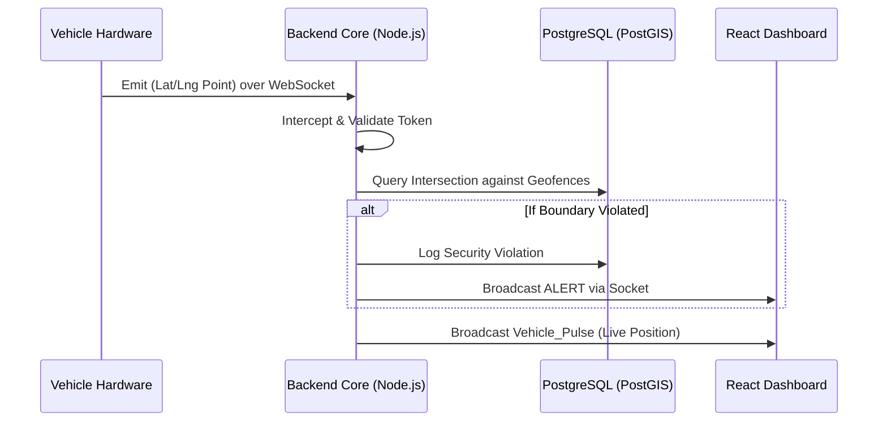

# FleetSpy Backend 🛰️

The Node.js/Express backend engine driving FleetSpy's real-time telemetry processing and geofencing capabilities.

## 🎯 Problem Statement
To accurately map hardware data onto a grid and calculate multi-polygonal geofence intersections, fleet systems require high-performance concurrency. Legacy poll-based REST APIs fall short under high loads of constant GPS pings, resulting in stale tactical data.

FleetSpy handles this natively by utilizing WebSocket-driven architecture with a geospatial database integration to calculate perimeter violations the millisecond a coordinate updates.

## 🏗️ High-Level Architecture



## 🚀 Setup Instructions

**Prerequisites:** Node.js (v18+) and PostgreSQL.

1. Ensure the PostgreSQL database is running.

2. Install dependencies:
   ```bash
   cd backend
   npm install
   ```

3. Environment Configuration:
   Create a `.env` file configuring the server and database:
   ```env
   PORT=3001
   DB_USER=youruser
   DB_PASSWORD=yourpass
   DB_HOST=localhost
   DB_PORT=5432
   DB_NAME=fleetspy
   JWT_SECRET=your_super_secret_jwt_key
   ```

4. Run Migrations:
   Make sure to run your database migrations (e.g., in `src/migrations/`) to construct the proper schema.

5. Start the backend:
   ```bash
   npm run dev
   ```