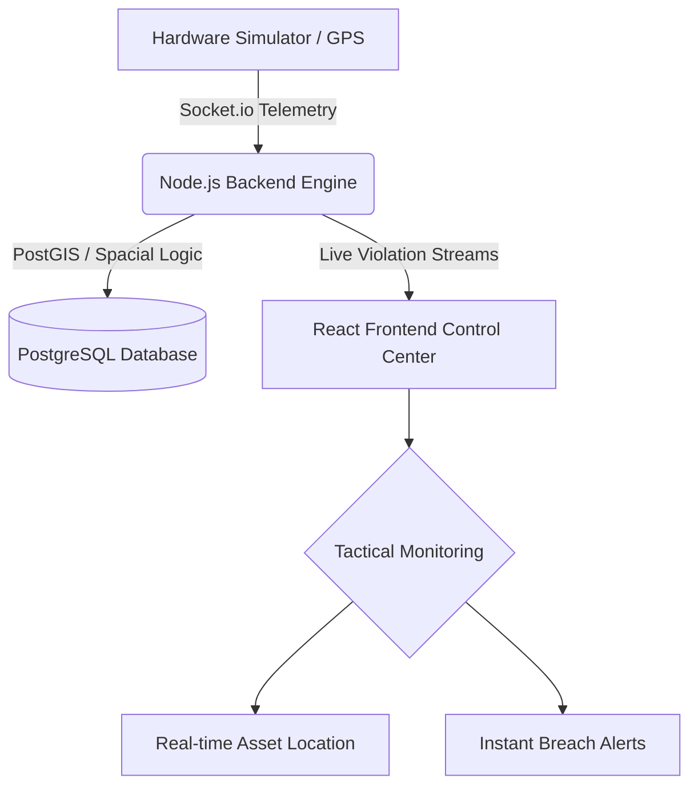

# FleetSpy Frontend 🛰️

FleetSpy is a real-time fleet intelligence and tactical tracking system. It enables autonomous monitoring of vehicle hardware telemetry against user-defined geofence containment zones to ensure asset security and operational efficiency.

## 🎯 Problem Statement

Logistics companies and fleet managers often struggle to accurately track their assets in real-time, resulting in poor operational efficiency, fuel waste, and security vulnerabilities (e.g., unauthorized route deviations). Furthermore, delayed incident reporting prevents swift mitigation maneuvers.

FleetSpy solves this by providing:

1. **Real-time Live Telemetry:** Streaming exact fleet coordinates via zero-latency WebSockets.
2. **Dynamic Geofencing:** Defining operational sectors that instantly trigger server-side rule engine violations when breached.
3. **Interactive Simulation:** An intuitive telemetry injector for engineers to validate hardware rules.

## 🏗️ High-Level Architecture



## 🚀 Setup Instructions

**Prerequisites:** Node.js (v18+)

1. Install dependencies:

   ```bash
   npm install
   ```

2. Environment Configuration:
   Create a `.env` file referencing the backend and socket domains:

   ```env
   VITE_API_URL=http://localhost:3001
   ```

3. Run the application:

   ```bash
   npm run dev
   ```

4. Build for production:
   ```bash
   npm run build
   ```
